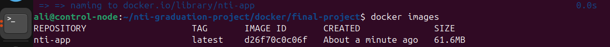

# Dockerized Flask App

This repository contains a simple Flask application with Docker support.

## Project Structure

    .
    ├── app.py
    ├── Dockerfile
    ├── README.md
    ├── requirements.txt
    ├── static
    │   ├── logos
    │   │   ├── ivolve-logo.png
    │   │   └── nti-logo.png
    │   └── style.css
    └── templates
        └── index.html

##  How to Build and Run with Docker

### 1. Build the Docker Image

Run this command in the project directory:

``` bash
docker build -t nti-app .
```


### 2. Run the Container

``` bash
docker run -d -p 5000:5000 --name nti-app-container nti-app
```

### 4. Access the App

Open your browser:

    http://localhost:5000

## 🛠 Dockerfile Used

``` dockerfile
FROM python:3.12-alpine

WORKDIR /app

COPY requirements.txt .

RUN pip install --no-cache-dir -r requirements.txt

COPY . .

CMD ["python", "app.py"]

EXPOSE 5000
```


