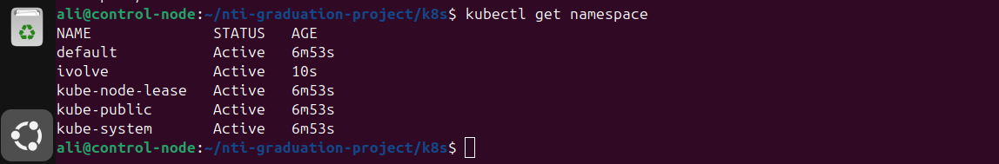
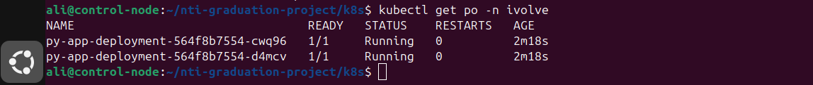
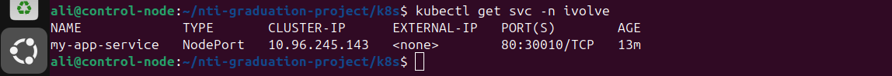
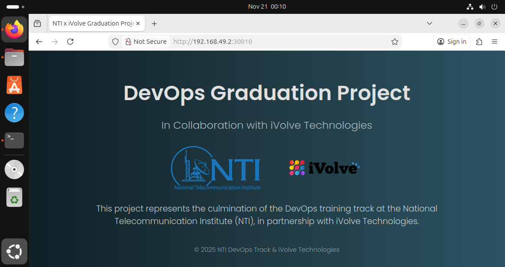

# Kubernetes Deployment on Minikube

This document describes how to deploy a Python application on a Minikube
Kubernetes cluster. It includes creating a namespace, applying a
deployment, creating a NodePort service, and accessing the application.

## 1. Start Minikube

Ensure Minikube is installed, then start it:

    minikube start

Verify the cluster is running:

    kubectl get nodes

## 2. Create the Namespace (Imperative Method)

Create the namespace named `ivolve`:

    kubectl create namespace ivolve

Confirm creation:

    kubectl get namespaces

## 3. Deployment Configuration

Create a file named `deployment.yaml`:

    apiVersion: apps/v1
    kind: Deployment
    metadata:
      name: py-app-deployment
      namespace: ivolve
      labels:
        app: py-app
    spec:
      replicas: 2
      selector:
        matchLabels:
          app: py-app
      template:
        metadata:
          labels:
            app: py-app
        spec:
          containers:
          - name: py-app
            image: maaryii/nti-app
            ports:
            - containerPort: 5000

Apply the deployment:

    kubectl apply -f deployment.yaml

Verify pods:

    kubectl get pods -n ivolve

## 4. Service Configuration (NodePort)

Create a file named `svc.yaml`:

    apiVersion: v1
    kind: Service
    metadata:
      name: my-app-service
      namespace: ivolve
    spec:
      selector:
        app: python
      type: NodePort
      ports:
        - protocol: TCP
          port: 80
          targetPort: 5000
          nodePort: 30010

Apply the service:

    kubectl apply -f svc.yaml

Check service details:

    kubectl get svc -n ivolve

## 5. Accessing the Application

Get the Minikube IP:

    minikube ip

Access the application in your browser:

    http://<minikube-ip>:30010

Example:

    http://192.168.49.2:30010

If the deployment and service are running correctly, the application
should load successfully.

## 6. Useful Debugging Commands

Check pods:

    kubectl get pods -n ivolve

Check service:

    kubectl get svc -n ivolve

Describe deployment:

    kubectl describe deployment py-app-deployment -n ivolve

View logs:

    kubectl logs <pod-name> -n ivolve

This completes the deployment and exposure of a Python application on
Minikube using a NodePort service.
