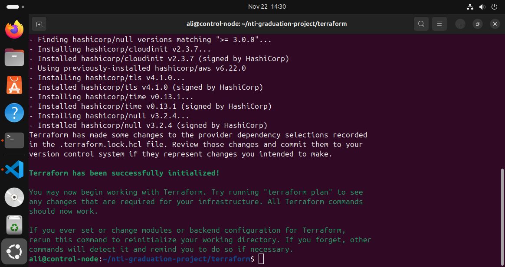
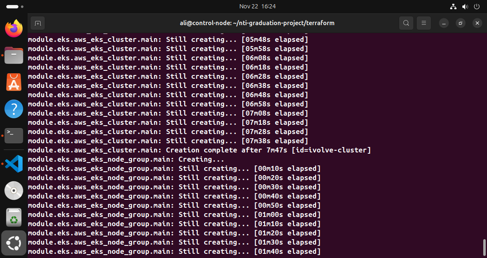
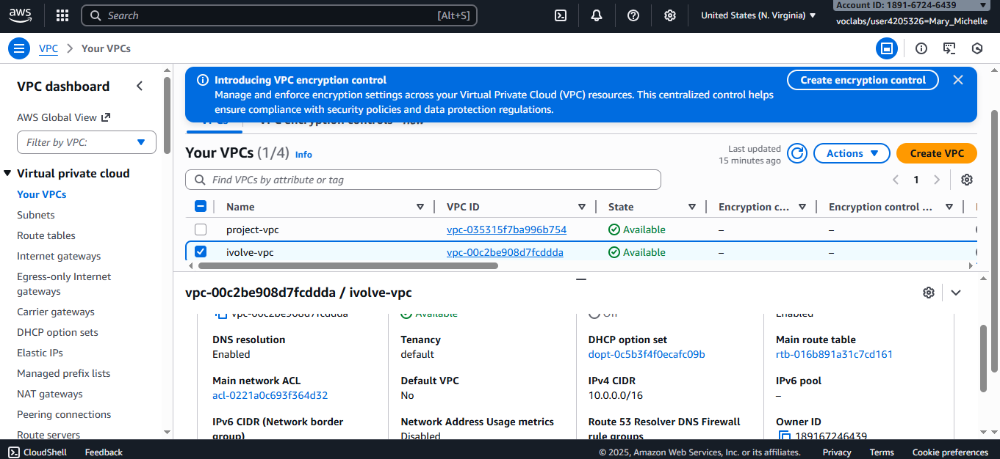
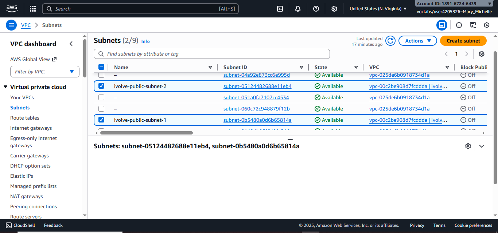
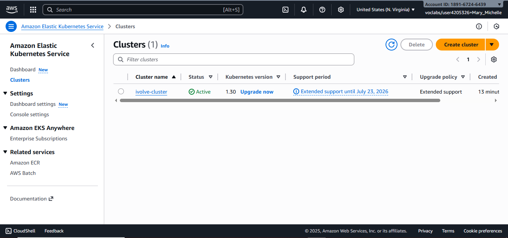

# AWS Infrastructure (Learner Lab)

This project provisions a fully‑functioning AWS environment using
Terraform inside the **AWS Learner Lab**, including:

-   VPC + Subnets\
-   EC2 Instances (Jenkins Master & Worker)\
-   EKS Cluster + Managed Node Group\
-   CloudWatch Monitoring & SNS Alerts\
-   Remote S3 Backend

It follows a modular structure and is fully reproducible.

------------------------------------------------------------------------

#  Project Structure

    terraform/
    ├── backend.tf
    ├── main.tf
    ├── modules
    │   ├── eks
    │   ├── monitoring
    │   ├── network
    │   └── server
    ├── provider.tf
    ├── terraform.tfvars
    ├── variables.tf
    └── screenshots/

------------------------------------------------------------------------

#  Deployment Instructions

## **Terraform Init**

Run:

    terraform init

## **Terraform Apply**

    terraform apply 

------------------------------------------------------------------------

# Verification Screenshots

-   
-   
-   
-   

------------------------------------------------------------------------

#  Summary

This setup deploys a complete AWS environment fully compatible with
**AWS Learner Lab restrictions**.
